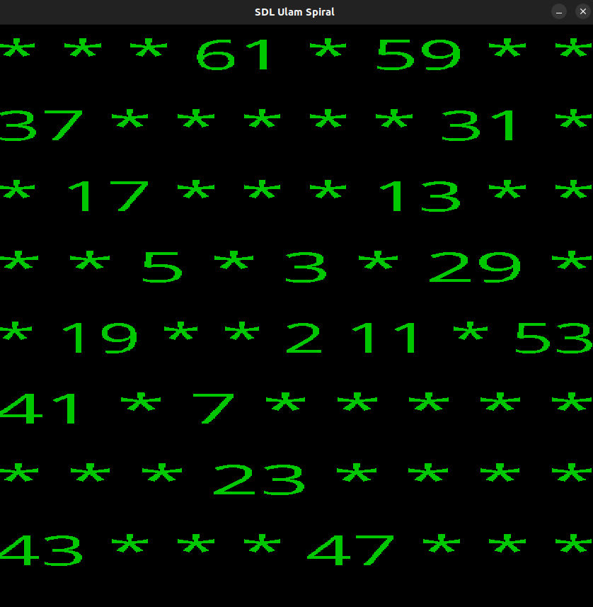

# SDL Ulam Spiral

SDL Ulam Spiral is a [Ulam Spiral](https://en.wikipedia.org/wiki/Ulam_spiral) generator written in C. The project is built using the SDL Library and can be run in both SDL app mode and a terminal app mode.

### SDL app mode



### Terminal app mode

```bash
*       *       *       61      *       59      *       *
37      *       *       *       *       *       31      *
*       17      *       *       *       13      *       *
*       *       5       *       3       *       29      *
*       19      *       *       2       11      *       53
41      *       7       *       *       *       *       *
*       *       *       23      *       *       *       *
43      *       *       *       47      *       *       *
```

## Ubuntu Prerequisites

Before running SDL Ulam Spiral, make sure you have the following installed on your system:

1. [Make](https://www.gnu.org/software/make/)
2. GCC (`apt install gcc`)
3. SDL library (`apt-get install libsdl2-ttf-dev`)

## Building and Running

To build and run SDL Ulam Spiral, use the following commands:

```bash
# SDL app mode
$ make
$ make OPT=sdl

# Terminal app mode
$ make OPT=terminal
```
