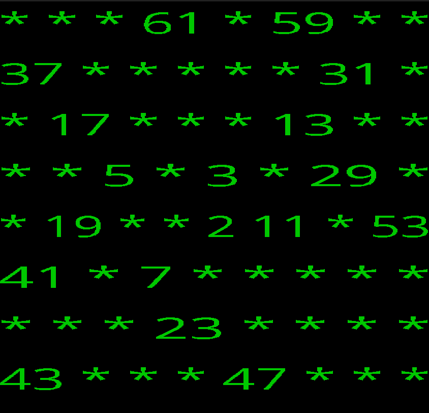

# Marcin

Marcin is a C-based [Ulam Spiral](https://en.wikipedia.org/wiki/Ulam_spiral) generator, utilizing the SDL Library. This versatile project allows users to effortlessly switch between an SDL application or terminal mode for added flexibility and ease of use.

## SDL mode



## Terminal mode

```bash
*       *       *       61      *       59      *       *
37      *       *       *       *       *       31      *
*       17      *       *       *       13      *       *
*       *       5       *       3       *       29      *
*       19      *       *       2       11      *       53
41      *       7       *       *       *       *       *
*       *       *       23      *       *       *       *
43      *       *       *       47      *       *       *
```

## Ubuntu Prerequisites

Before you can build and run Marcin, make sure you have the following installed on your system:

1. [Make](https://www.gnu.org/software/make/)
2. GCC (`apt install gcc`)
3. SDL library (`apt-get install libsdl2-ttf-dev`)

## Build and Run Instructions

To build and run the project as an SDL app, execute:

```bash
$ make
# or
$ make sdl
```

For running in the terminal, use:

```bash
$ make terminal
```
